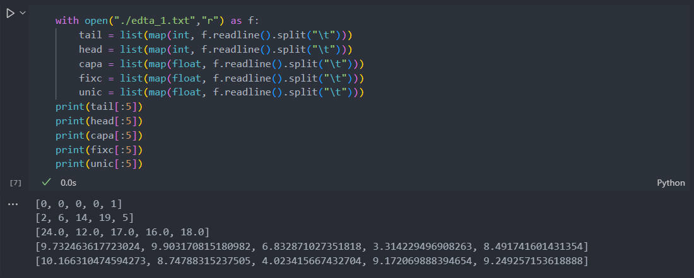

  An introduction for synthetic data 

# 1. Overview
This file introduces the data of instances with varying scales. All instances are divided into two groups, small-scale instances, and large-scale ones. They are saved in two files named Small-scale instances and Large-scale instances. Each file contains several files to store the instances with specific scales. For example, in the file "scale_20_100", instances consist of 20 nodes and 100 edges. 

# 2. Introduction of instances
Each instance consists of two txt files named 'edta_X.txt' and 'ndta_X.txt', where 'X' distinguishes the different instances. The 'edta_X.txt' file stores a matrix with five rows whose columns represent different edges. The explanations in order are shown as follows. 

  1. node index (int): the tail of this edge;
  2. node index (int): the head of this edge;
  3. capacity (int): the maximum allowable flow value of this edge;
  4. fixed cost (double): the fixed cost of this edge;
  5. unit cost (double): the unit cost of this edge.

The 'ndta_X.txt' file stores a vector whose item is the supply/demand of the node corresponding to the current index. 

# 3. Data load example
There is a specific example in Python to illustrate the load of instances.

